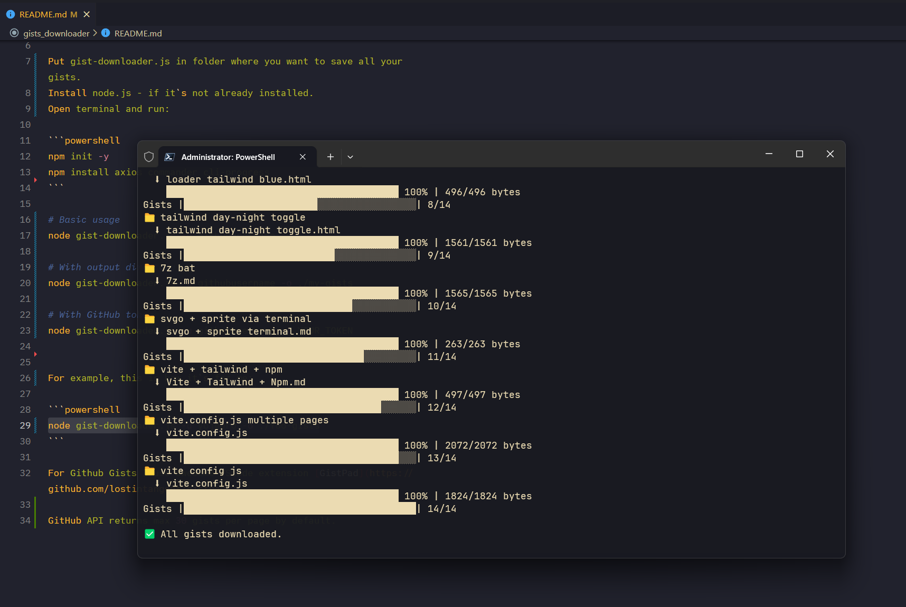

#### Download all your gists via PowerShell with progress bar on Windows 11.

Each gist will be downloaded into its own separate folder with the gist name. 

Put gist-downloader.js in folder where you want to save all your gists.   
Install node.js - if it`s not already installed.   
Open terminal and run:   

```
npm init -y   
npm install axios commander cli-progress   
```   

#### Basic usage
node gist-downloader.js -u githubusername

#### With output directory
node gist-downloader.js -u githubusername -o ./my-gists

#### With GitHub token
node gist-downloader.js -u githubusername -t YOUR_TOKEN


For example, this is how it`s for me:   

```
node gist-downloader.js -u yojeero -o ./My-gists  
```

For Github Gists I use awesome VSCode extension [GistPad](https://github.com/lostintangent/gistpad).

GitHub API returns max 30 gists per page by default.